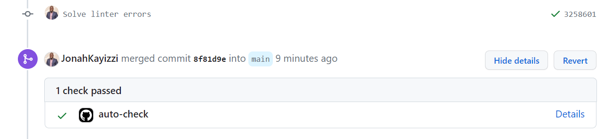

<a name="readme-top"></a>


<div align="center">

  <h3><b>ARRAY QUADRUPLET CODING CHALLENGE</b></h3>

</div>

<!-- TABLE OF CONTENTS -->

# 📗 Table of Contents

- [📗 Table of Contents](#-table-of-contents)
- [📖 ARRAY QUADRUPLET ](#-array-quadruplet-)
  - [🛠 The Challenge ](#-the-challenge-)
    - [Tech Stack ](#tech-stack-)
  - [💻 Getting Started ](#-getting-started-)
    - [Prerequisites](#prerequisites)
    - [Setup](#setup)
    - [Run tests](#run-tests)
  - [👥 Authors ](#-authors-)
  - [🤝 Contributing ](#-contributing-)
  - [⭐️ Show your support ](#️-show-your-support-)
  - [🙏 Acknowledgments ](#-acknowledgments-)
  - [📝 License ](#-license-)

<!-- PROJECT DESCRIPTION -->

# 📖 ARRAY QUADRUPLET <a name="about-project"></a>


**ARRAY QUADRUPLET** is another medium difficulty coding challenge that I found on PRAMP.

## 🛠 The Challenge <a name="built-with"></a>
Given an unsorted array of integers `arr` and a number `s`, write a function `findArrayQuadruplet` that finds four numbers (quadruplet) in `arr` that sum up to `s`. Your function should return an array of these numbers in an ascending order. If such a quadruplet doesn’t exist, return an empty array.

Note that there may be more than one quadruplet in `arr` whose sum is `s`. You’re asked to return the first one you encounter (considering the results are sorted).

Explain and code the most efficient solution possible, and analyze its time and space complexities.

**Examples:**
`input:  arr = [2, 7, 4, 0, 9, 5, 1, 3], s = 20`

`output: [0, 4, 7, 9] # The ordered quadruplet of (7, 4, 0, 9)`
                    `# whose sum is 20. Notice that there`
                     `# are two other quadruplets whose sum is 20:`
                     `# (7, 9, 1, 3) and (2, 4, 9, 5), but again you’re`
                     `# asked to return the just one quadruplet (in an`
                     `# ascending order)`

**Constraints:**

**[time limit] 5000ms**
**[input] array.integer arr**
**1 ≤ arr.length ≤ 100**
**[input] integer s**
**[output] array.integer**

### Tech Stack <a name="tech-stack"></a>


<details>
  <summary>Language</summary>
  <ul>
    <li><a href="https://www.javascript.com/">JavaScript</a></li>
  </ul>
</details>

<!-- GETTING STARTED -->

## 💻 Getting Started <a name="getting-started"></a>


To get a local copy up and running, follow these steps.

### Prerequisites

In order to run this project you need:

```sh
 npm install
 Nodejs
```


### Setup

Clone this repository to your desired folder:


```sh
  cd JS-ArrayQuadruplet-CodingChallenge
  git clone https://github.com/JonahKayizzi/JS-ArrayQuadruplet-CodingChallenge.git
```


### Run tests

To run tests, run the following command:


```sh
  npm run test
```
OR 

Submit a pull_request and ensure that all auto_checks pass

<div align="center">
  
</div>

<p align="right">(<a href="#readme-top">back to top</a>)</p>


## 👥 Authors <a name="authors"></a>

👤 **Jonathan Kayizzi**

- GitHub: [@JonahKayizzi](https://github.com/JonahKayizzi)
- Twitter: [@JonahKayizzi](https://twitter.com/JonahKayizzi)
- LinkedIn: [LinkedIn](https://www.linkedin.com/in/jonathan-kayizzi/)


<p align="right">(<a href="#readme-top">back to top</a>)</p>


<!-- CONTRIBUTING -->

## 🤝 Contributing <a name="contributing"></a>

Contributions, issues, and feature requests are welcome!

Feel free to check the [issues page](https://github.com/JonahKayizzi/JS-ArrayQuadruplet-CodingChallenge/issues).

Contribute my providing more optimal approaches with better performance and time complexity

<p align="right">(<a href="#readme-top">back to top</a>)</p>

<!-- SUPPORT -->

## ⭐️ Show your support <a name="support"></a>


If you like this project you can give me a ⭐️

<p align="right">(<a href="#readme-top">back to top</a>)</p>

<!-- ACKNOWLEDGEMENTS -->

## 🙏 Acknowledgments <a name="acknowledgements"></a>

I would like to thank [Pramp](https://www.pramp.com/dashboard#/) for this coding challenge

<p align="right">(<a href="#readme-top">back to top</a>)</p>


<!-- LICENSE -->

## 📝 License <a name="license"></a>

<p align="right">(<a href="#readme-top">back to top</a>)</p>
